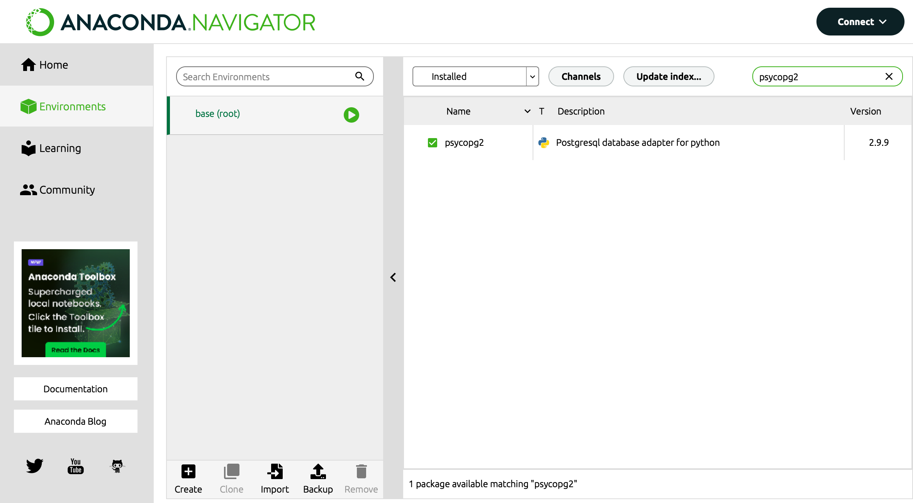

# Database Migration and Rollback Instructions
These instructions will guide you through the process of migrating your PostgreSQL database schema according to the provided specifications and rolling back the changes if needed. The migration involves renaming columns, altering column lengths, and transforming data types.

## Prerequisites
- Ensure that you have PostgreSQL installed and running.
- Make sure you have necessary permissions to create and modify tables in your database.
- Python package psycopg2. To install use: [pip install psycopg2](https://pypi.org/project/psycopg2/)
- ... or install package with the help of [Anaconda Navigator](https://docs.anaconda.com/free/navigator/install/) 

## Step 1: Initialization
First, let's initialize the database tables and populate them with sample data.

### Using Python Script
1. Open your preferred terminal or command prompt.
2. Navigate to the directory containing the Python script (initTable.py).
3. Execute the script by running python initTable.py.
4. Verify that the tables students and interests are created and populated with sample data.

### Using SQL Script
1. Open your preferred terminal or command prompt.
2. Log in to your PostgreSQL database using psql or any other client.
3. Run the SQL script initTable.sql using the command \i **'path/to/initTable.sql'**.
4. Verify that the tables students and interests are created and populated with sample data.

## Step 2: Migration
Now, let's perform the database migration according to the provided specifications.

### Using Python Script
1. Ensure that the database connection parameters in the Python script (migration.py) are correctly set according to your PostgreSQL configuration.
2. Open your preferred terminal or command prompt.
3. Navigate to the directory containing the Python script (migration.py).
4. Execute the migration script by running python migration.py.
5. Verify that the migration is successful by checking the changes in the database schema and data.

### Using SQL Script
1. Open your preferred terminal or command prompt.
2. Log in to your PostgreSQL database using psql or any other client.
3. Run the SQL script migration.sql using the command **\i 'path/to/migration.sql'**.
4. Verify that the migration is successful by checking the changes in the database schema and data.

## Step 3: Rollback
If you need to revert the changes made during the migration, you can perform a rollback.

### Using Python Script
1. Open your preferred terminal or command prompt.
2. Navigate to the directory containing the Python script (rollback.py).
3. Execute the rollback script by running python rollback.py.
4. Verify that the rollback is successful by checking that the database schema and data are reverted to their initial state.

### Using SQL Script
1. Open your preferred terminal or command prompt.
2. Log in to your PostgreSQL database using psql or any other client.
3. Run the SQL script rollback.sql using the command **\i 'path/to/rollback.sql'**.
4. Verify that the rollback is successful by checking that the database schema and data are reverted to their initial state.

### Additional Notes

* Ensure that you have appropriate backups of your database before performing any migration or rollback.
* Double-check the database connection parameters and file paths before executing the scripts.
* If you encounter any errors during the migration or rollback process, refer to the error messages for troubleshooting.

By following these instructions, you should be able to perform the database migration and rollback seamlessly without any questions regarding the details. If you have any further queries or issues, feel free to reach out for assistance.